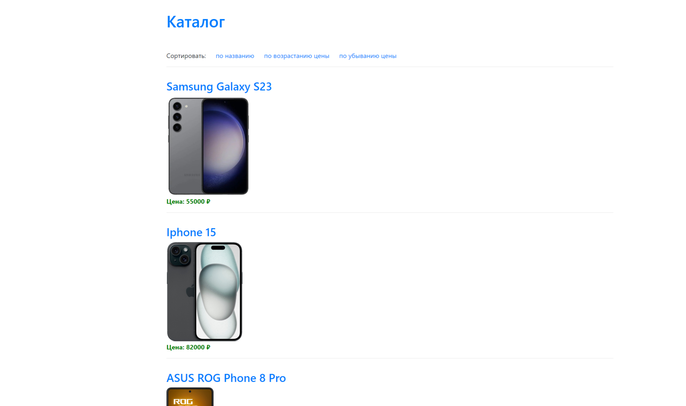

# Домашнее задание Django "Работа с ORM"

## `Порядок работы`

1. В файл [password.ini](password.ini) необходимо вставить `название БД`, 
`имя пользователя` и `пароль` для работы в `postgresql`. При желании эти данные 
можно ввести в соответствующие поля в файле [settings.py](main%2Fsettings.py)
2. Необходимо записать в БД структуру таблицы и заполнить ее данными. 
Для этого в терминале необходимо последовательно выполнить команды
   * `python manage.py makemigrations`
   * `python manage.py migrate`
   * `python manage.py import_phones`
3. Далее запускаем приложение командой `python manage.py runserver`. 
В браузере должна появиться страница по адресу `<имя_сайта>/` (http://127.0.0.1:8000/)

4. Далее можно нажимать ссылки: `Каталог` (стартовая страница), 
`сортировки` и `перехода на страницу каждой марки телефона` .
5. Реализована возможность просмотра таблицы БД, для этого 
нужно перейти по адресу `<имя_сайта>/admin/` (http://127.0.0.1:8000/admin/)

## Задание

Есть некоторый [csv-файл](./phones.csv), который выгружается с сайта-партнера. 
Этот сайт занимается продажей телефонов.
Мы же являемся их региональными представителями, поэтому нам необходимо 
взять данные из этого файла и отобразить 
их на нашем сайте на странице каталога, с их предварительным сохранением в базу данных.

## Реализация

Что необходимо сделать:
* В файле `models.py` нашего приложения создаем модель 
Phone с полями `id`, `name`, `price`, `image`, `release_date`, `lte_exists` и `slug`. 
Поле `id` - должно быть основным ключом модели.
* Значение поля `slug` должно устанавливаться слагифицированным значением поля `name`.
* Написать скрипт для переноса данных из csv-файла в модель `Phone`. 
Скрипт необходимо разместить в файле `import_phones.py` 
в методе `handle(self, *args, **options)`
* При запросе `<имя_сайта>/catalog` - должна открываться страница 
с отображением всех телефонов.
* При запросе `<имя_сайта>/catalog/iphone-x` - должна открываться 
страница с отображением информации по телефону.
* В каталоге необходимо добавить возможность менять 
порядок отображения товаров: по названию (в алфавитном порядке) и 
по цене (по-убыванию и по-возрастанию).

## Подсказка

Для переноса данных из файла в модель можно выбрать один из способов:
 * воспользоваться стандартной библиотекой языка python : `csv` (рекомендуется)
 * построчно пройтись по файлу и для каждой строки сделать соответствующую запись в БД
 
Для реализации сортировки можно к урлу добавить параметр sort и 
получать его через `request.GET`. Например:
 * `<имя_сайта>/catalog?sort=name` - сортировка по названию
 * `<имя_сайта>/catalog?sort=min_price` - сначала отображать дешевые

